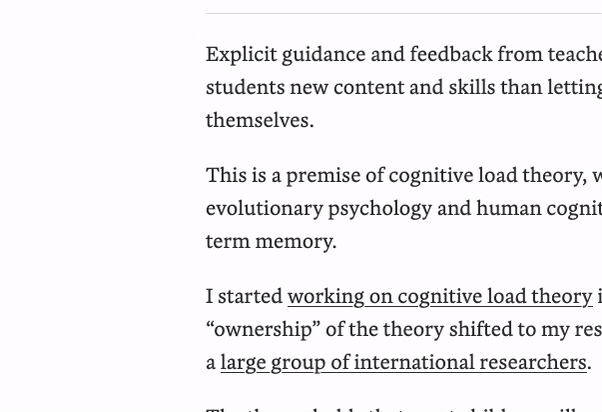
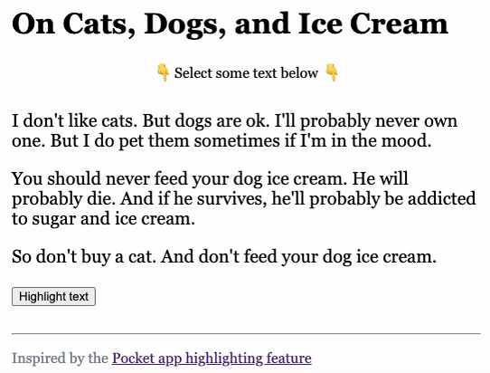

# Pocket Highlighting

Code study in text highlighting. Inspired by the [Pocket app](https://help.getpocket.com/article/1144-highlighting-in-pocket).

**Pocket**

**Prototype**

## Roadmap

- [x] Add ability to clear highlight
- [ ] Hide button until text is highlighted
- [ ] Add ability to select multiple paragraphs

---

GIFs created using QuickTime and [Online Converter](https://www.onlineconverter.com/mov-to-gif).
