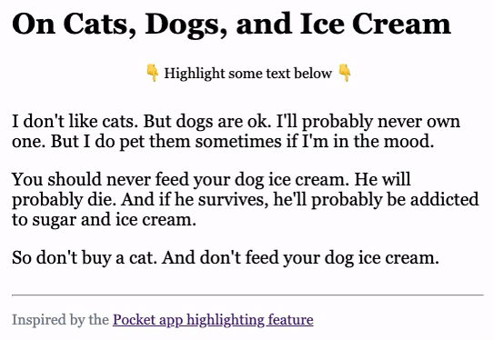

# Pocket Highlighting

Code study in text highlighting. Inspired by the [Pocket app](https://help.getpocket.com/article/1144-highlighting-in-pocket).

## Roadmap

- [ ] Add ability to clear highlight
- [ ] Add ability to select multiple paragraphs
- [ ] Add [webpack](https://webpack.js.org/) hot reloading—to speed up development

## References

- [Get the Highlighted/Selected text](https://stackoverflow.com/a/5379408/11809808) - Stack Overflow
- [Element: mouseup event](https://developer.mozilla.org/en-US/docs/Web/API/Element/mouseup_event) - MDN web docs
- [javascript user selection highlighting](https://stackoverflow.com/a/317399/11809808) - Stack Overflow
